# MaterialX shader-parity prototype

## Outcome

The prototype adds an isolated `/materialx` route and a material backend contract without changing any production material dispatch or renderer. Its default reference implementation is offline-generated official MaterialX 1.39.4 ESSL running in a route-owned `WebGLRenderer`/`RawShaderMaterial`; `?implementation=tsl` retains the Three `MaterialXLoader`/`WebGPURenderer` experiment. Existing `WebGLRenderer`, `ShaderMaterial`, `EffectComposer`, and post-processing pages remain untouched.

The supplied `chrome.003` material can be extracted reproducibly from `NO3D Chrome Asset Library.blend` through Blender 5.1's native USD MaterialX network into standalone `.mtlx`. Native extraction reconstructs Blender Generated coordinates from exported object-space bounds and restores `rough:float` as `geompropvalue` from the exact FACE-domain 2.5D Chrome Crayon geometry contract. The extraction report has no substituted semantics. The native graph is now generated to official MaterialX 1.39.4 ESSL and available as an opt-in shader preview on the live 97,784-vertex / 97,776-face GN-VM asset. Three 0.185.1's TSL loader still lacks `geompropvalue`, so this recovered graph remains on the official-ESSL path.

This is semantic and binding parity, not renderer identity. The matched 2.5D capture reaches full-frame RMSE `0.057457` and luminance correlation `0.681123`; the zero-roughness metallic highlights differ much more inside the visible object because Eevee and MaterialX FIS use different BRDF/environment filtering. `Authored chrome.003` therefore remains the default, with `Recovered chrome.003 · native MaterialX` exposed for direct review.

The requested Noise/Wave bump description does not match the supplied graph. `chrome.003` contains Noise, but no Wave and no Bump node. The lab therefore exposes two clearly separate views plus an explicit baked fallback:

- `ChromeCrayonSourceLowering`: the earlier general semantic-recovery probe using exported bounds and a typed `rough` property. It remains historical adapter evidence; the recovered native graph is now captured on the live 2.5D asset separately.
- `ChromeCrayonNoiseBumpProbe`: a general Noise-to-normal compatibility probe. It is not represented as source parity.
- `baked-pbr`: a Blender/Cycles tangent-normal and roughness bake for the same probe, used to isolate graph loss from renderer differences.

Unsupported graphs resolve through `materialx -> baked-pbr -> legacy-authored -> normalized`; named geometry properties are eligible for the isolated official-ESSL backend only when their exported name, type, domain, and buffer item size all agree.

## Existing architecture and migration boundary

Production material selection remains the hard-coded authored chain in `src/chrome-assets.ts`. That path tries topology-aware authored reconstructions and ends with a normalized diagnostic material. It runs under `WebGLRenderer`. The 2.5D Chrome Crayon adds one explicit opt-in official-ESSL preview selected by the user; it does not replace the authored default or alter any other asset.

The building route also uses `WebGLRenderer`, custom `ShaderMaterial`, `EffectComposer`, and WebGL render targets. Three's installed `MaterialXLoader` imports node materials from `three/webgpu`; its source states that these materials require `WebGPURenderer`. `WebGPURenderer` tries WebGPU and initializes a WebGL2 node backend when WebGPU is unavailable. That fallback is not the legacy `WebGLRenderer`, and custom `ShaderMaterial` has no node-library mapping there.

The safe boundary is therefore:

```text
existing routes                     /materialx reference         /materialx?implementation=tsl
WebGLRenderer                       isolated WebGLRenderer       isolated WebGPURenderer
ShaderMaterial + post-processing    official generated ESSL      MaterialXLoader + TSL nodes
existing authored dispatch          explicit backend resolution  explicit backend resolution
```

No global renderer migration is part of this checkpoint.

During TSL development, reload the route after editing the renderer-owned module instead of relying on Vite hot replacement. A fresh WebGPU load is clean, but Chromium can retain the previous swap-chain texture across HMR and report that its texture view belongs to a different GPU device. The deterministic reference capture now uses the official ESSL/WebGL2 backend and does not exhibit this device-lifetime issue.

### Metallic reflection requirement

The first comparison initially lit both spheres only with analytic directional lights. That made Blender's direct highlights visible but left Three's metal nearly black between the much smaller raster highlights. This was a lighting-contract defect, not a reason to alter the MaterialX graph.

The reference harness now generates `studio-environment.exr`, a 256×128 linear HDR test fixture containing neutral, blue, and warm softboxes, plus `studio-irradiance.exr`, a 64×32 third-order spherical-harmonic cosine convolution. Blender and the browser use the radiance file at `0.18` strength while MaterialX diffuse lobes receive the separate irradiance map. The ESSL adapter enables trilinear radiance mipmaps and performs official 16-sample filtered importance sampling. No material name, color, metalness, or roughness override is involved.

### Canonical height-to-normal correction

Research against MaterialX 1.39.4, `bhouston/material-fidelity`, and Three PR #33485 found that the original probe topology was invalid. `heighttonormal` produces an encoded tangent-space normal; it cannot feed `standard_surface.normal` directly. The valid chain is:

```text
fractal3d -> heighttonormal(Blender Strength)
          -> normalmap(Blender Distance)
          -> standard_surface.normal
```

The adapter now ports the general MaterialX 1.39.4 Sobel lowering, including its `1/16` factor, and the PR's world tangent/bitangent/normal frame. It never matches a material name. Probe geometry now computes tangents; production geometry must likewise provide indexed position, normal, UV, and tangent attributes or derive a tangent frame.

This corrected lowering changed the conclusion of the first PR experiment. Its recorded pre-fixture-fix run improved the released r185 prototype from sphere RMSE `0.263554` / correlation `0.197453` to `0.233939` / `0.398053`; full-frame RMSE improved from `0.099224` to `0.088114`, and correlation from `0.766935` to `0.825208`. Those upstream numbers predate the outward-winding correction described below and are retained only as implementation-delta provenance.

### Three r186 pull request evaluation

The research follow-up is reproducible without changing the shipped Three dependency:

```bash
npm run materialx:test:upstream
```

The command pins open Three.js PR [#33485](https://github.com/mrdoob/three.js/pull/33485) to commit `bce55b294825d273eae3e178aab3191f719594e6`, downloads it to ignored cache, and captures three implementations under the same geometry, camera, lights, environment, exposure, and color transform:

- released Three 0.185.1 plus this prototype's general derivative-normal adapter;
- PR #33485 using its native `heighttonormal`; and
- PR #33485 plus the same local adapter, isolating noise changes from normal conversion.

The source-lowering image is byte-identical under all three implementations. The historical table below used the invalid direct `heighttonormal -> surface.normal` graph and is retained as regression provenance, not as the current recommendation:

| Noise bump implementation | sphere-only MAE | sphere-only RMSE | luminance correlation |
| --- | ---: | ---: | ---: |
| Three 0.185.1 + local adapter | 0.188714 | 0.263554 | 0.197453 |
| PR #33485 native normal | 0.198945 | 0.266316 | 0.129329 |
| PR #33485 + local adapter | 0.188714 | 0.263554 | 0.197453 |

After inserting the required `normalmap`, setting its Distance to `0.1`, and computing mesh tangents, the recorded pre-fixture-fix PR run reached sphere RMSE `0.233939` and correlation `0.398053`. The same general functions are now ported locally; current parity evidence comes from the corrected official ESSL fixture rather than promoting those historical pixels.

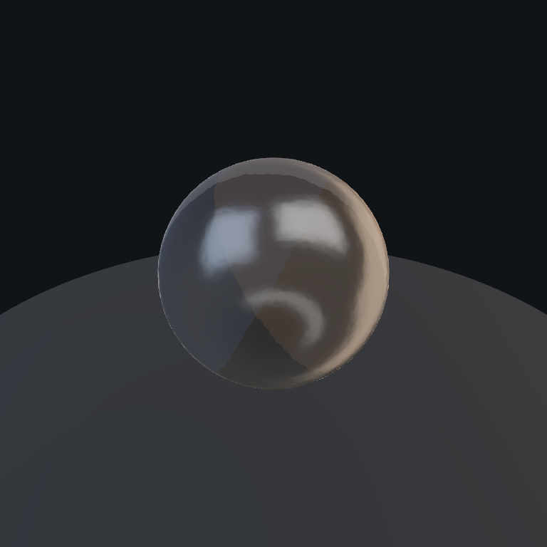
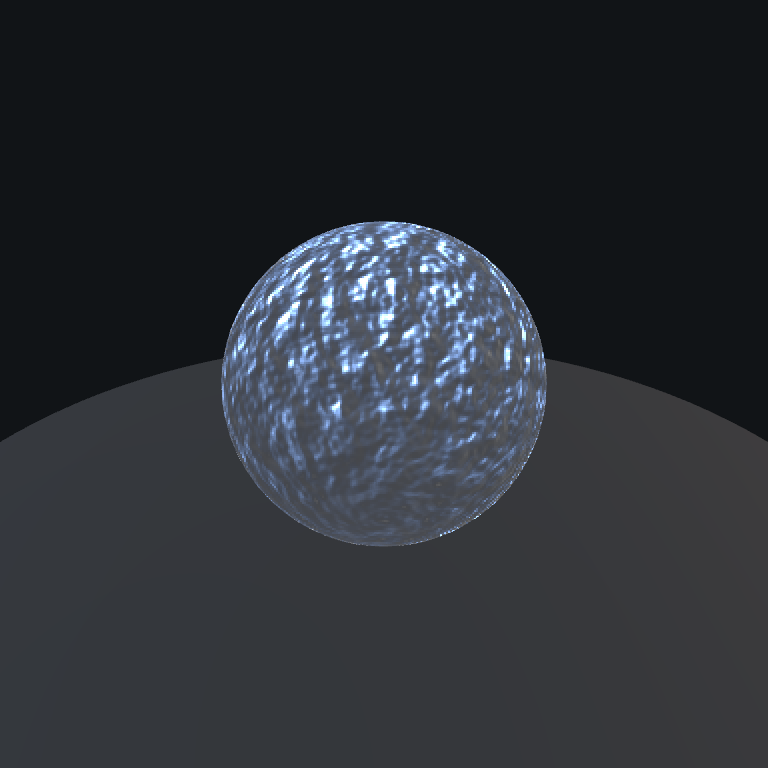

Machine-readable archive evidence is stored in `docs/materialx-evidence/archive/upstream-comparison.json`. Duplicate adapter/source captures were removed because their byte identity is already recorded in that JSON. The experimental alias is opt-in and never changes production dependency resolution.

## Backend contract

`src/material-backend.ts` defines:

```text
materialx -> baked-pbr -> legacy-authored -> normalized
```

Resolution is total, records every attempted backend, and reports why a fallback was selected. The isolated `/materialx` route uses this contract. The Chrome Asset viewer now has a narrower asset-specific review mode for recovered `chrome.003`, while its default production dispatch remains authored.

Recommended production integration for one material:

1. Add a portable graph descriptor and texture dependency manifest.
2. Preflight the `.mtlx` before loading; unknown loader elements silently become zero otherwise.
3. Request `materialx` only on a node-renderer-owned viewport.
4. Supply `baked-pbr` assets where procedural semantics cannot travel.
5. Preserve the current authored factory as `legacy-authored`.
6. Promote the portable backend only after Blender/browser evidence is accepted.

## Exact first-target support

Source node types from Blender 5.1.2:

| Blender node | Lowering | Status |
| --- | --- | --- |
| Principled BSDF | `standard_surface` | supported after OpenPBR input normalization |
| Noise Texture, 3D FBM | `fractal3d` | supported, but Blender and MaterialX noise implementations are not identical |
| Map Range, linear | `remap` | supported |
| Mapping | `multiply`, `rotate3d`, `add` | supported |
| Math, multiply | `multiply` | supported |
| Combine XYZ / Value | typed constants | supported |
| Texture Coordinate, Generated | `(object position - exported bounds min) / max(bounds extent, epsilon)` | recovered by native extractor and supported by official ESSL path |
| Attribute, named `rough` | `geompropvalue` + FACE-domain source contract + flat-expanded vertex buffer | recovered by native extractor and official ESSL path; Three TSL rejects it |
| Attribute, named `col` diagnostic | `geompropvalue` + typed `a_geomprop_col` color3 point buffer | supported by the same manifest-driven binding; not a `chrome.003` source node |
| Material Output | `surfacematerial` | supported |

The supplied material has no Wave or Bump node. For the broader Chrome material library, exact unsupported semantics include:

- Wave Texture (`wave` has no `MaterialXLoader` implementation).
- White Noise equivalence.
- Named attributes whose exported type/domain or geometry buffer is missing or mismatched. The official-ESSL adapter supports declared point/vertex GPU properties generally; Three's TSL path does not yet support `geompropvalue`.
- Backfacing, Transparent/Mix Shader topology, Window coordinates, and Eevee bevel groups.
- Procedural `heighttonormal` under Three r185. Its built-in implementation forward-samples `TextureNode` UVs and does not reliably perturb a procedural node.

`src/materialx/procedural-height.ts` addresses the last item with a general MaterialX-compatible derivative and tangent-frame adapter. It compiles supported MaterialX height topology (`position`, `texcoord`, constants, conversion/extract, arithmetic, remap/clamp, Noise, and Fractal3D), recognizes the canonical `heighttonormal -> normalmap` wrapper, preserves separate Strength and Distance, and never checks material names. Image-based height maps continue through Three's native path.

## Baked-PBR fallback evidence

`npm run materialx:bake` invokes Blender 5.1/Cycles as an external authoring tool and emits a 1024×512 raw tangent-normal map, a raw roughness map, and a portable image-based `.mtlx`. The lab's `baked-pbr` backend loads those textures without changing the production renderer.

The Blender procedural-to-baked comparison isolates semantic preservation: sphere RMSE is `0.004668` and correlation is `0.999838`. Blender-to-Three remains much weaker (MaterialXLoader sphere correlation about `0.20`), and normal-scale/sign sweeps do not fix it. That separates a successful bake from the remaining Eevee/Three BRDF and light-energy mismatch. The bake is geometry/UV-specific; it is a fallback for the baked asset, not a portable replacement for arbitrary geometry.

## Official ASWF ESSL/FIS reference backend

MaterialX 1.39.4's official ESSL generator is now the lab's default reference backend. It compiles and links in WebGL2, renders through a Three `RawShaderMaterial`, binds three directional-light NodeDefs before generation, uploads the generated `LightData` structs, and supplies the required radiance, irradiance, environment-matrix, camera, and object uniforms.

The initial experiment used the official browser/worker distribution, which adds about 4.1 MB uncompressed. The committed implementation instead generates ESSL once at authoring time with Blender 5.1.2's bundled MaterialX 1.39.4 Python modules; no shader-generator WASM is shipped. The generated interface manifest pins MaterialX, FIS sample count, maximum light count, light NodeDef/type ID, shader paths, attributes, uniforms, defaults, and source paths. Generated third-party notices remain embedded in the shaders.

| Renderable | Vertex shader | Fragment shader | Active uniforms |
| --- | ---: | ---: | ---: |
| source lowering | 821 B | approximately 103 KB | manifest-recorded |
| Noise bump probe | 901 B | approximately 103 KB | manifest-recorded |
| smooth direct-light diagnostic | 821 B | approximately 103 KB | manifest-recorded |

This is the most promising legally compatible fidelity path found in the repository survey: official MaterialX is Apache-2.0, Blender remains an external authoring tool, and the application ships generated shader text rather than a generator runtime. It is still a specialized `RawShaderMaterial`/WebGL2 reference backend, not a drop-in replacement for Three lighting. It is used as a semantic and lighting oracle while the TSL path matures.

The matched Noise bump comparison now reaches full-frame RMSE `0.055410` and luminance correlation `0.935745`. Its sphere mean luminance is closely matched (`0.449082` Blender versus `0.457048` browser). Sphere-local RMSE is `0.146605` and correlation is `0.804343`; the remaining structure is dominated by Eevee versus MaterialX reflection filtering and the explicitly non-identical Blender/MaterialX Noise functions. These are renderer/semantic differences, not evidence that FIS or light binding failed.

The successful authoring command invoked Blender's bundled Python directly. On this macOS package `PyMaterialXGenShader` must be imported before `PyMaterialXGenGlsl` so the latter resolves its native dependency:

```bash
npm run materialx:generate:essl
```

`tools/materialx/generate_essl.py` performs the same steps as MaterialX's official `generateshader.py`: load default libraries, attach the data library, create `EsslShaderGenerator` and a complete shader interface, install default color management, bind `ND_directional_light`, find renderable elements, emit vertex/pixel stages, and serialize the complete interface manifest. Generation fails on any MaterialX version other than `1.39.4`.

### External implementation survey

- [Langenium PR #42](https://github.com/OpenStudiosCo/Langenium/pull/42), referenced by the supplied Open Studios article, hand-ports individual Blender graphs into `ShaderMaterial`. It is useful evidence for visualizing intermediate nodes and caching materials, but it is not a graph translator. Its material-specific GLSL has no PMREM/IBL integration, assigned `metalness`/`roughness` properties do not alter a custom `ShaderMaterial`, and its bump samples do not reproduce MaterialX's canonical neighboring height evaluations. Several shader fragments also point to Blender-, Shadertoy-, or otherwise ambiguously licensed upstream sources. No source from it is copied here.
- [Three.js PR #33485](https://github.com/mrdoob/three.js/pull/33485), still open at pinned head `bce55b294825d273eae3e178aab3191f719594e6`, is the strongest MIT TSL implementation. It improves noise, transforms, defaults, validation, Standard Surface, OpenPBR, and general bump/normal topology. The lab remains pinned because the change has not merged.
- [Material Fidelity](https://github.com/bhouston/material-fidelity), MIT commit `79ed6ed77d3e109c62849c49f53bca43e3b1aa4c`, provides the best reusable differential-test methodology across MaterialX Viewer, Blender, and Three. It is test inspiration, not runtime code.
- `@needle-tools/materialx` proved that official ESSL plus correct environment sampling can restore metallic radiance and Blender-like highlight cores. Its wrapper is PolyForm Noncommercial 1.0.0, so it is not a generally mergeable dependency. The underlying Apache-2.0 MaterialX behavior is being reproduced through the official generator instead.
- Armory3D demonstrates a topology-general Blender-node compiler, but some relevant node semantics are approximate and some fragments are Blender-derived. Its traversal architecture is informative; its shader source is not used.

Matched experiments ruled out simple scene tweaks as the root fix: explicit Standard Surface `specular=1` is byte-identical for this fully metallic probe, 4x sphere tessellation is slightly worse, Blender Sun angle `0°` versus `8°` changes the sphere by only RMSE `0.007124`, and stronger direct lights only change energy. The apparent mirrored-light problem was instead an invalid comparison fixture: both probe generators wound their triangles inward. Eevee rendered the two-sided backfaces, while Three's `FrontSide` path culled the near hemisphere and shaded the far hemisphere. Both fixtures now use explicitly outward winding and a topology regression test.

### Focused environment, light, and coordinate research

The renderers do not merely consume the same HDR pixels with different intensity constants:

- MaterialX 1.39.4 defaults to filtered importance sampling. Its JavaScript viewer rebuilds the HDR as a linear `DataTexture`, enables ordinary trilinear mipmaps, uses 16 FIS samples per shaded pixel, loads a separate diffuse irradiance HDR, and applies a fixed `+90°` Y environment transform for its own viewer convention.
- The official native MaterialX viewer also supplies a second Apache-2.0 path: `createEnvPrefilterShader` renders every lat-long mip through MaterialX's own GGX prefilter shader. The generator uses 1024 samples per texel during this one-time pass, after which materials use the prefiltered environment lookup.
- Blender Eevee 5.1 uses a different reflection-probe representation and filter. It remaps the world to an octahedral atlas, builds five explicitly convolved roughness levels, takes 196 samples per output texel, approximates GGX with a spherical-Gaussian weighting, uses a nonlinear roughness-to-LOD curve up to roughness `0.7`, and blends toward spherical-harmonic lighting from roughness `0.7` to `0.9`.

This explains the broad rectangular Three highlight versus Blender's tighter light cores. The implemented reference path uses official MaterialX FIS with the unmodified lat-long radiance texture and a separately convolved irradiance texture. The faster follow-up can use MaterialX's own Apache-licensed prefilter pass. Copying Blender's GPL shader is neither required nor allowed; it remains comparison evidence only.

The existing Three scene rotation of `270°` is consistent with the official MaterialX viewer's shader-space `+90°`: Three applies scene environment rotations with the opposite sign before lookup. This transform is environment-only. Direct lights use the Blender world-space vectors in `scene-contract.json`: evaluated Sun local `-Z` is MaterialX's propagation direction, and the generated `ND_directional_light` negates it to obtain surface-to-light `L`. No material-name mapping or fitted light basis remains. `coordinate-cardinals-web.png` shows `+X`, `+Z`, `-X`, `-Z`; the upper row samples environment radiance and the lower row evaluates those bound lights.

The contract is checked independently with environment-disabled, zero-angular-radius renders for key, fill, and rim. Their normalized sphere correlations are `0.991038`, `0.988250`, and `0.975296`; RMSE values are `0.068691`, `0.029614`, and `0.038945`. These images prove directional placement. Differences in highlight width and energy remain renderer/BRDF differences and are not described as graph-semantic parity.

Three PR #33485 confirms that coordinate parity needs several independent fixes, not one global flip:

- explicit `bottom-left` versus `top-left` UV-space selection for native Three geometry and glTF geometry;
- correct column-vector matrix order for `transformpoint`;
- world/object support and camera-relative sign for `viewdirection`;
- normalized normal, tangent, and bitangent inputs;
- canonical `heighttonormal` derivatives with the MaterialX `1/16` Sobel scale; and
- `normalmap`/`bump` evaluation in the supplied tangent frame.

Those rules should become small diagnostic renders before further visual tuning.

### Additional adapter feasibility evidence

[MaterialXNodeDocs](https://github.com/joaovbs96/MaterialXNodeDocs), Apache-2.0 at commit `8c55f105dc6c60a12880afbf284f3a29a30ba14f`, independently implements the complete browser bridge: shader generation, uniform-block introspection, MaterialX attribute aliases, per-frame matrices, `RawShaderMaterial`, separate radiance/irradiance HDRs, `+90°` environment/light rotation, light-struct uploads, and compile diagnostics. It is strong proof that the adapter is practical and legally reusable. It is not suitable for direct vendoring: it currently uses runtime WASM, Three r128, and contains viewer-specific fallback patches. The project should reimplement only the small required interface against Three 0.185.1 and the offline-generated manifest.

Needle 1.7.4 provides additional inspect-only feasibility evidence. It supports Three PMREM, MaterialX prefiltered lat-long, and MaterialX FIS modes; maps Three environment rotations and intensities into generated MaterialX shaders; adapts Three light/shadow structures; and handles tangents and instancing. Its PolyForm Noncommercial 1.0.0 wrapper is not copied or distributed. These results show that the remaining work is engineering and calibration, not an unavailable browser capability.

## Second representative graph: UI normal band

The isolated lab now exercises the UI normal-band branch selected by graph topology, not by material name. `tools/materialx/build_ui_normal_band_probe.mjs` discovers the unique active `Texture Coordinate Normal -> Mapping -> CONSTANT ColorRamp` branch mixed with a named color property, then emits `ui-normal-band-prototype.mtlx` and a machine-readable capability report. The same manifest-driven adapter used for `rough:float` binds `col:color3`; there is no UI-specific shader code.

Blender Mapping's XYZ angles require a general sign-convention lowering when passed to the official ESSL `rotate3d` implementation. With that node-semantic correction, the matched diagnostic reaches full-frame RMSE `0.008603` and luminance correlation `0.999426`; the normalized sphere region reaches RMSE `0.012820` and correlation `0.992491`.

This is not source parity. The UI branch capability report still records two substituted semantics:

- Blender native USD declares Texture Coordinate Normal in world space, while the standalone official ESSL graph resolves this input as object space. The matched diagnostic uses an identity-transformed probe so the spaces are equivalent, but transformed-asset parity remains gated.
- Blender's implicit `Color -> Material Output Surface` coercion is represented by an explicit `standard_surface` emission wrapper.

The portable metadata does not include the source `.blend`, so its native MaterialX extraction and any Background/group surface context cannot yet be audited. The existing authored UI material remains the production fallback.

## Deferred representative graphs

- Procedural Mahogany requires Wave plus named `col1`, `col2`, `scale`, and `rot` attributes.
- Toon relies on ShaderToRGB and Background/group surface semantics.

Their existing authored materials remain the production fallback. The exact lists are machine-readable in `public/materialx/manifest.json`.

## Reproducible extraction

The primary path uses Blender 5.1 only:

```bash
npm run materialx:extract
```

The command:

1. opens the supplied `.blend` in Blender 5.1;
2. assigns the requested material to an isolated probe;
3. invokes Blender's native USD export with `generate_materialx_network=True`;
4. translates the USDShade `ND_*` graph to standalone MaterialX 1.39;
5. normalizes OpenPBR surface inputs to Standard Surface;
6. validates the result with Blender's bundled MaterialX library; and
7. writes the source/node/texture report beside the graph.

Texture dependencies use Blender's `NEW` texture export mode and are reported relative to the output directory. This first material has none.

Set `BLENDER_BIN` when Blender is not installed in the default macOS location. The generated artifacts are:

- `public/materialx/chrome-crayon-native.mtlx`
- `public/materialx/chrome-crayon-native.report.json`
- `public/materialx/chrome-crayon-prototype.mtlx`

## Reference render contract and evidence

Reproduce the Blender images, start the Vite development server, capture the browser images, then compare:

```bash
npm run materialx:render:blender
npm run materialx:render:25d
npm run dev -- --host 127.0.0.1 --port 4173
npm run materialx:capture:web
npm run materialx:capture:25d
npm run materialx:compare
npm run materialx:compare:25d
```

Both renderers use the same outward-wound 64×32 UV sphere algorithm, 96-segment floor disc, evaluated Blender camera matrix, three directional lights, generated linear studio environment at `0.18` strength, exposure, and Standard/sRGB transform with no tone mapping. `scene-contract.json` records the authoritative camera and Sun transforms. The environment affects reflections but not the solid camera background. Deterministic capture uses the isolated official ESSL/WebGL2 backend; the optional TSL experiment uses `WebGPURenderer` and its automatic fallback.

Committed evidence:

| Pair | RGB MAE | RGB RMSE | luminance correlation | Interpretation |
| --- | ---: | ---: | ---: | --- |
| source semantic-recovery probe | 0.058130 | 0.165673 | 0.663904 | historical pre-recovery adapter capture; not the recovered native graph |
| Noise bump probe, canonical topology | 0.019253 | 0.055410 | 0.935745 | shiny response and normal structure align closely; renderer filtering still differs |
| UI normal-band branch diagnostic | 0.004005 | 0.008603 | 0.999426 | typed `col` and band topology align; normal-space and surface substitutions remain |
| live 2.5D native `chrome.003` | 0.010685 | 0.057457 | 0.681123 | exact live geometry and recovered source graph; zero-roughness Eevee/FIS highlights remain different |

The normalized sphere-only result for the canonical probe is RMSE `0.146605`, correlation `0.804343`, and mean luminance `0.449082` (Blender) versus `0.457048` (browser). The per-light direction evidence and these measurements are stored beside the full-frame values in `comparison.json`.

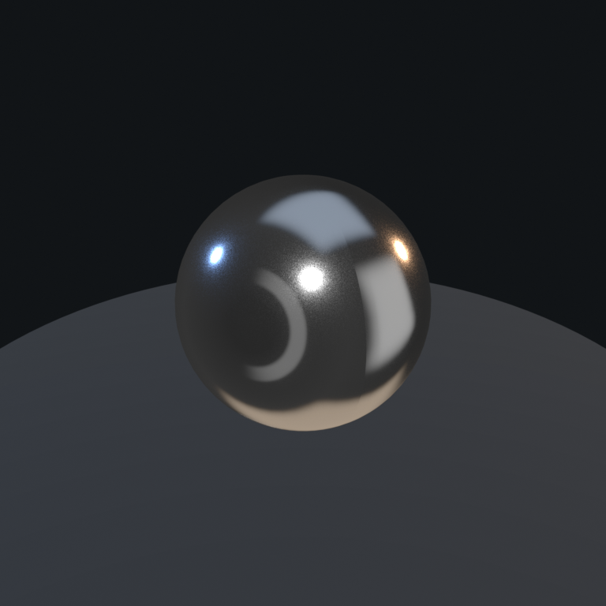
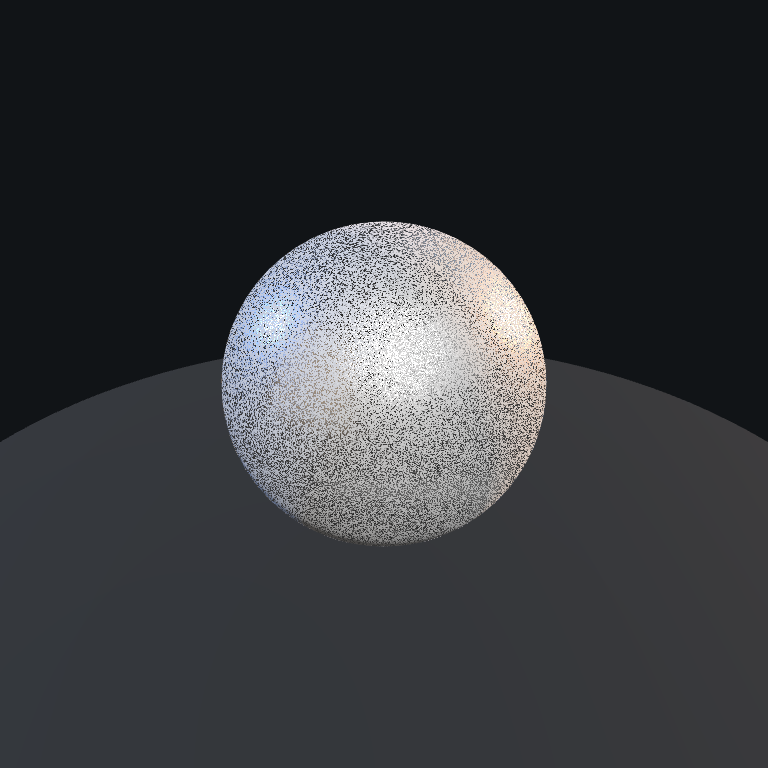
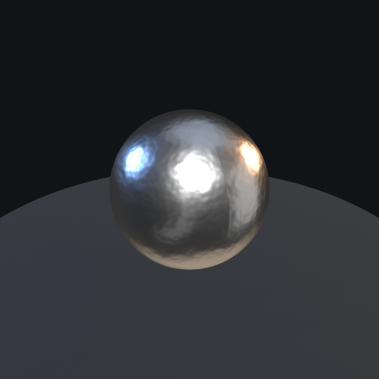
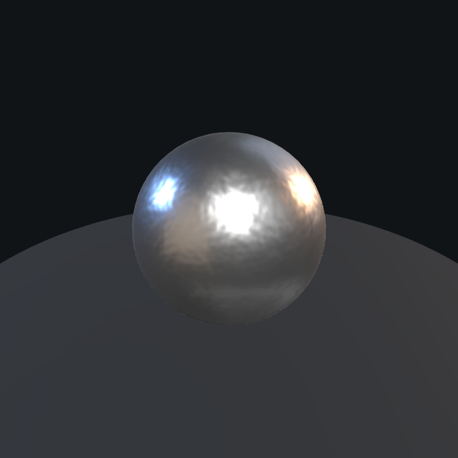
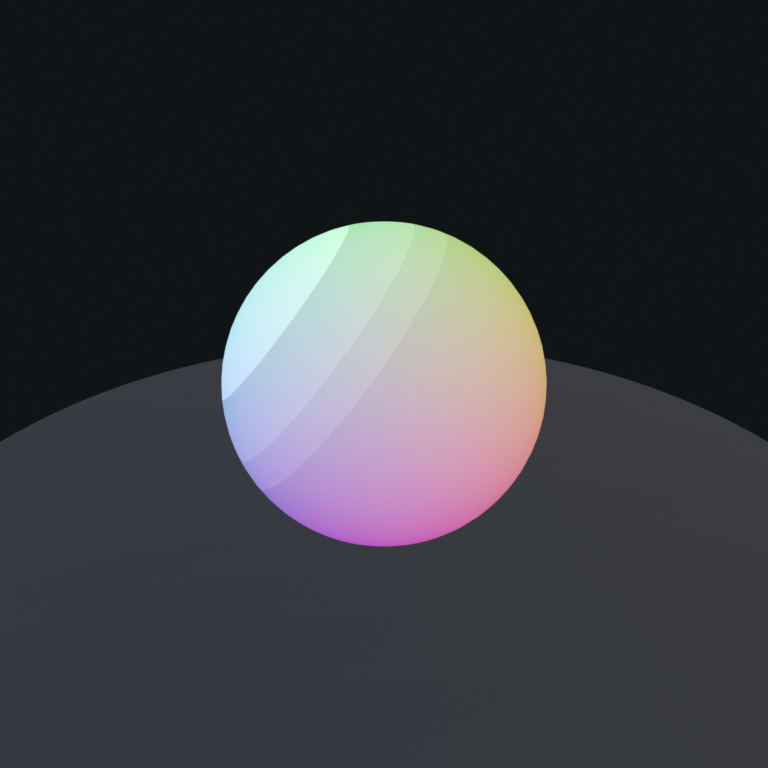
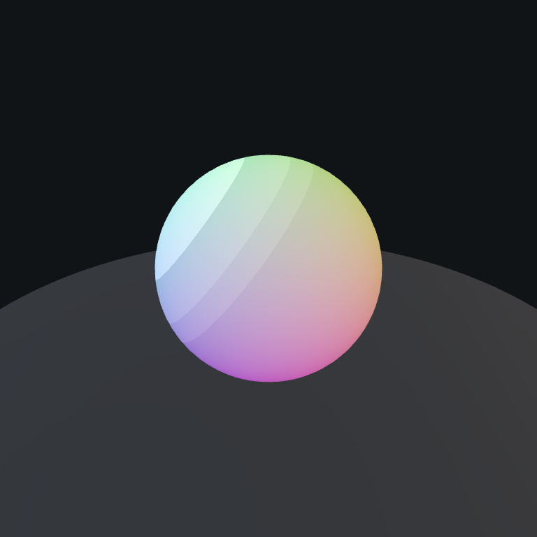
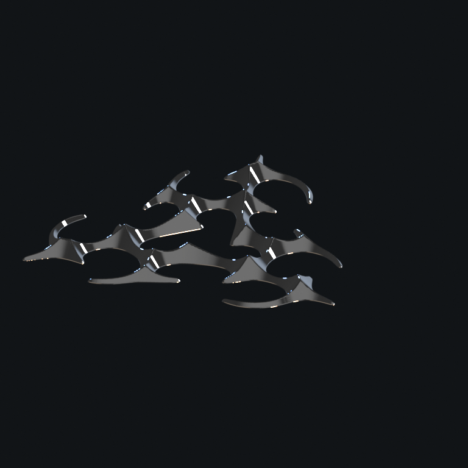
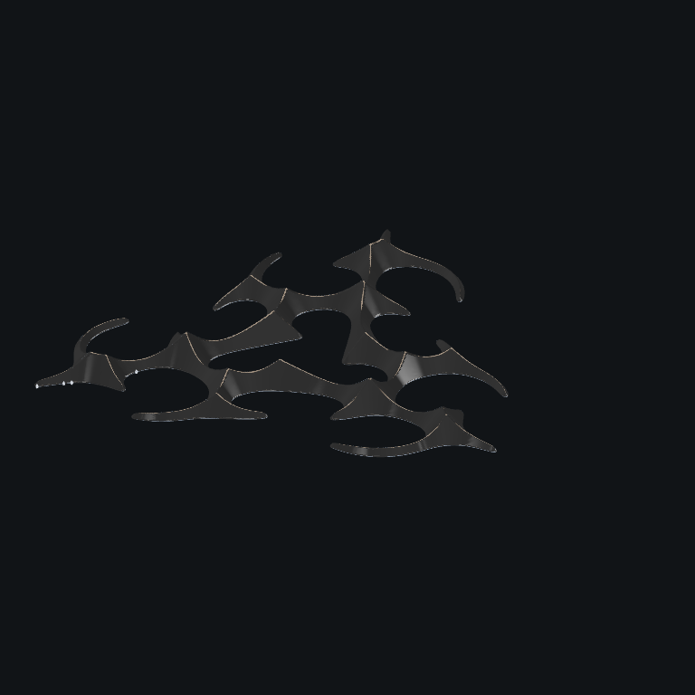

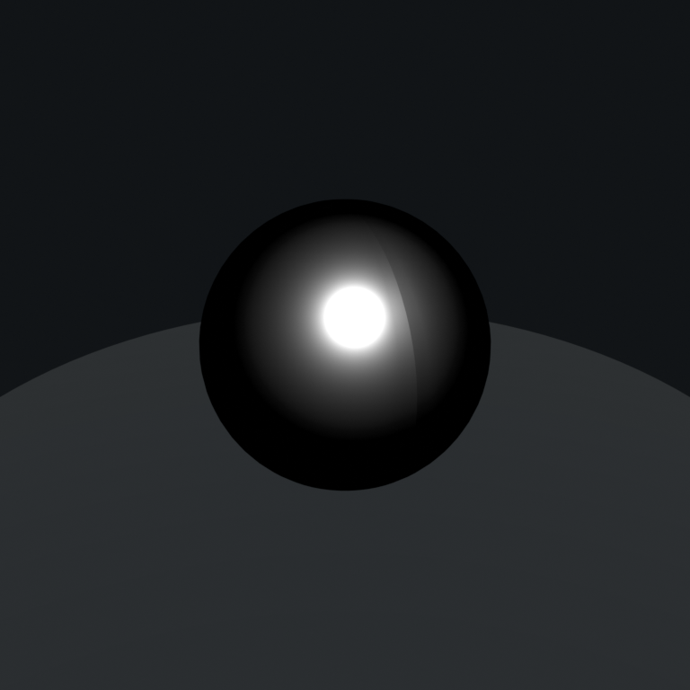
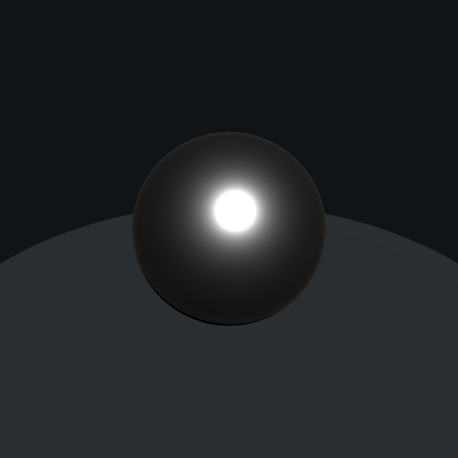

These pixel measurements are renderer evidence, not graph-semantic proof. Graph support is independently recorded in the extraction report and manifest. `chrome-crayon-native.report.json.capability.substitutedSemantics` is empty, and native ESSL/live geometry/capture gates now pass. The authored shader remains the default because the foreground highlight comparison still demonstrates material-renderer differences; the native result is an explicit review mode rather than a silent replacement.

## Verification

The implementation checkpoint, closed light-direction investigation, ordered follow-up work, and production promotion criteria are maintained in [MATERIALX_NEXT_STEPS.md](./MATERIALX_NEXT_STEPS.md).

Focused tests cover backend ordering, loader preflight, procedural-height detection, committed source facts, MaterialX assets, and evidence metadata. The full geometry suite and production build remain the merge gates:

```bash
npm test
npm run materialx:smoke:essl
npm run build
```
